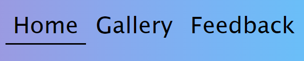
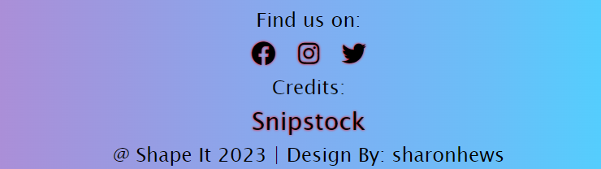

# SHAPE IT

Shape it  is a site for help people to get them out of their confort zone and try something new such as yoga. This site is first step to people of all age groups who wants to change their lives in so many ways such as better understand of your body and mind .

# Features

My site is for all age groups which is why i have made simple and short for users to understand. I have explained what is yoga, by giving all the useful details of the yoga it self as benefits it has on your body to change your life for better and also i put down few different basic types of yoga as there is many more types out there but these are the basic ones. 
In my gallery page i have given few yoga poses and explanations on how to do them.
On my feedback form readers can leave their reviews if they are happy with the page of my content or they would like to get more content. After readers submit their feedback thank you note comes up.

# Existing Features

- __Site Colors__

Site colors was generated using css function linear-gradient, visualizing from left to right.

background-image: linear-gradient(to right, #d16ba5, #c777b9, #ba83ca, #aa8fd8, #9a9ae1, #8aa7ec, #79b3f4, #69bff8, #52cffe, #41dfff, #46eefa, #5ffbf1);

- __Google fonts__

for best appearance of website, hand writing fonts been choose from google fonts

Amatic SC - used for page logo, navigation and important links in footer.

Bad Script - used for main content and gallery.

- __Page Logo__

Shape It logo simply describing it self as to shape your mind and body. To grab readers atention to Shape It beside it I have an eye catching animated siluate of yoga freestyle to make it more interesting.

- __Navigation__

Fully responsive navigation bar includes links to the Logo Home page, Gallery, Feedback page and submitting thank you page.All pages are identical and in each page it allows for easy navigation.This section will alow all the users to navigate between each page across all devices withouth having to use back button in order to open another page.

- __Website main content__

This section outlines the reader of understanding what is yoga, what does it do to our bodys muscles and our over all help.

- __Gallery__

In gallery page in particullar we concentrate all on the poses of yoga.
I have given an image of an animated siluate doing yoga to show off how the pose is suppose to look after completion.

added picture and name of poses

In this section users will be able to try out few most basic and simple yoga poses to see if they feel like thats what they want to be adding to their life style. I have given detailed description step by step on how to achieve the pose.

- __Feedback__

This page will allow the users to give their feedback about Shape It page as they can leave a feedback in comment section stating if they consider taking on yoga or maybe its to difficult for them.

- __Footer__

In footer i have included sites where you can find us at any time. You can find us on Facebook, Instagram and also Twitter. I give credits to Snipstock for the animated pictures that i have included in my site.

- __Thanks for Feedback__

Shape it is designed by my self sharonhews.

# Testing

I tested that this page works on devices: PC, Amazon tablet, 55inch Samsung TV, Nintendo Switch, Xiaomi Phone.
Tested on multiple browsers: Opera, Chrome, Edge.
I confirmed that this project is responsive, good looking in most screen sizes.
I confirmed that all text is readable on most devices.
Header, navigation, footer, contact form are readable and easy to understand.
I confirmed that contact form works: requires entries in every field and submit button works.

# Bugs

# Validator testing

HTML
No errors were returned when passing through the official W3C validator
CSS
No errors were found when passing through the official (Jigsaw) validator
Accessibility
I confirm that the colors and fonts chosen are easy to read and accessible by running it through lighthouse in devtools

Desktop version:

Mobile version:

