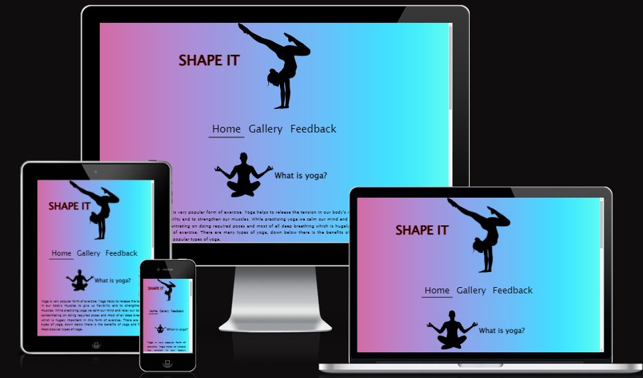

# SHAPE IT

Shape it  is a site for help people to get them out of their confort zone and try something new such as yoga. This site is first step to people of all age groups who wants to change their lives in so many ways such as better understand of your body and mind .

# Features

My site is for all age groups which is why i have made simple and short for users to understand. I have explained what is yoga, by giving all the useful details of the yoga it self as benefits it has on your body to change your life for better and also i put down few different basic types of yoga as there is many more types out there but these are the basic ones. 
In my gallery page i have given few yoga poses and explanations on how to do them.
On my feedback form readers can leave their reviews if they are happy with the page of my content or they would like to get more content. After readers submit their feedback thank you note comes up.

# Existing Features

- __Site Colors__

Site colors was generated using css function linear-gradient, visualizing from left to right.

background-image: linear-gradient(to right, #d16ba5, #c777b9, #ba83ca, #aa8fd8, #9a9ae1, #8aa7ec, #79b3f4, #69bff8, #52cffe, #41dfff, #46eefa, #5ffbf1);

- __Google fonts__

Amatic SC

Bad Script

- __Page Logo__

