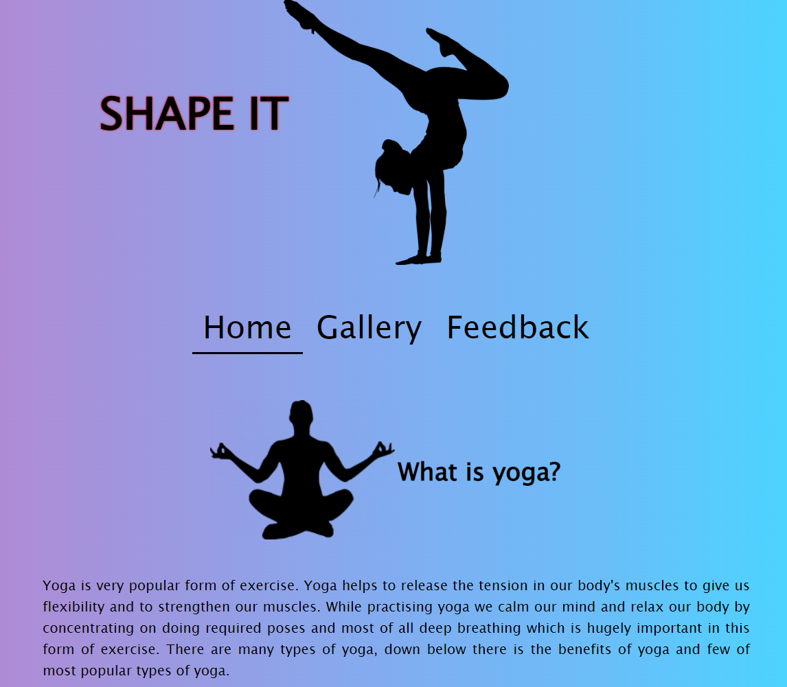
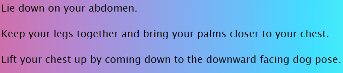
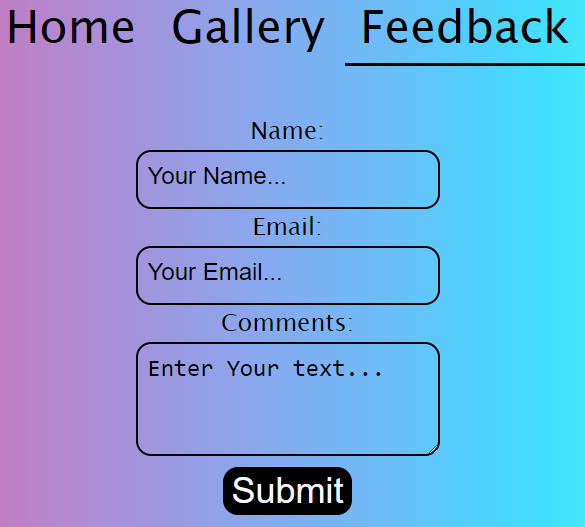

# SHAPE IT

Shape it is a site for helping people to get them out of their comfort zone and try something new such as yoga. This site is the first step for people of all age groups who want to change their lives in so many ways such as better understand about your body and mind.

# Features

My site is for all age groups which is why I have made simple and short for users to understand. I have explained what is yoga, by giving all the useful details of the yoga itself as the benefits it has on your body to change your life for the better, and also me put down few different basic types of yoga as there are many more types out there but these are the basic ones.

# Existing Features

- __Site Colors__

.
Bright colors have been chosen to best describe what is yoga and what it stands for. Colors was generated using css function linear-gradient, visualizing from left to right to provide visual attraction to the transition.

- __Page Logo__

Shape It logo simply describing itself as to shape your mind and body. To grab readers attention to Shape It beside it I have an eye catching animated silhouette of yoga freestyle to make it more interesting.

- __Navigation__

Fully responsive navigation includes links to the Home page, Gallery and Feedback page. All pages are identical, and on each page it allows for easy navigation. This section will allow all the users to navigate between each page across all devices without having to use the back button in order to open another page.

- __Website main content__

This section provides the reader with information about what yoga is and how it affects your health.

- __Gallery__

In the gallery page in particular, we focus on yoga poses.
I have included an image of an animated figure doing yoga to show what the finished pose looks like.

Users will be able to try out few most basic and simple yoga poses to see if they feel like that's what they want to be added to their life style. I have given detailed description step by step on how to achieve the pose.

- __Feedback__

This page will allow the users to give their feedback about Shape It page as they can leave a feedback in the comment section stating if they consider taking on yoga or maybe its too difficult for them.

- __Footer__

In footer, I have included sites where you can find us at any time. You can find us on Facebook, Instagram and also Twitter. I give credits to Snipstock for the animated pictures that I have included in my site.

# Testing

I tested that this page works on devices: PC, tablet, Phone.
Tested on multiple browsers: Opera, Chrome, Edge.
I confirmed that this project is responsive, good looking in most screen sizes.
I confirmed that all text is readable on most devices.
Header, navigation, footer, contact form are readable and easy to understand.
I confirmed that contact form works: requires entries in every field and submit button works.

# Bugs

having an issue with pictures height and with.  Fixed
problems with navigation sizing between different screen sizes. fixed

# Validator testing

HTML
No errors were returned when passing through the official W3C validator
CSS
No errors were found when passing through the official (Jigsaw) validator
Accessibility
I confirm that the colors and fonts chosen are easy to read and accessible by running it through lighthouse in devtools

Desktop version:

Mobile version:

# Deployment

Web site was deployed to GitHub pages.

Live link can be found here 

# Credits

Pictures was taken from 
